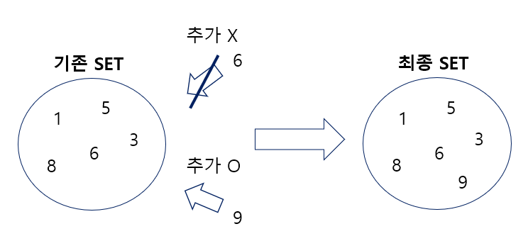

# SET

**목차**

- [SET](#set)
    - [들어가기 전](#들어가기-전)
  - [SET이란?](#set이란)
  - [SET의 특징](#set의-특징)

### 들어가기 전

> 해당 글은 백준 7785번 회사에 있는 사람 구현 후 SET에 대해 정리한 글이다.  
> 기존에 알고 있었지만 잊어버린 내용에 대해서 다시 정리하며 복습하는 차원...

## SET이란?

JAVA의 대표적인 Collection 중 하나로 **중복을 허용하지 않는** 자료형  
SET의 구현체로는 HashSet이 있다.

```
Set<Integer> set = new HashSet<>();
```



## SET의 특징

1. 동일한 값을 허용하지 않는다.
2. 데이터를 넣은 순서가 유지되지 않는다.
3. 데이터 삽입 후 수정이 가능하다
4. 내부적으로 HashMap의 매커니즈을 사용해 삽입, 삭제, 검색의 시간 복잡도가 **O(1)** 로 매우 우수하다
