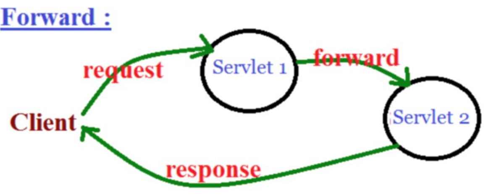

# 포워드(Forward)

**목차**   
[Forward 란?](#forward-란?)  
[과정](#과정)  
[예시](#예시)  
[Redirect와 Forward 차이점](#redirect와-forward-차이점)

## Forward 란?

클라이언트가 서버에게 요청을 보낸 것을 서버가 처리하다가 추가적인 처리를 웹 어플리케이션 안에 포함된 **다른 서블릿이나 JSP**에게 위임하는 방법

## 과정

1. 웹 브라우저(Client)에서 Servlet1에게 요청을 보냄
2. Servlet1은 요청을 처리한 후, 그결과를 HttpServletRequest에 저장
3. Servlet1은 결과가 저장된 HttpServletRequest객체와 응답을 위한 HttpServletResponse를 같은 웹 어플리케이션 안에 있는 Servlet2에게 전송(forward)
4. Servlet2는 Servlet1로 부터 받은 HttpServletRequest와 HttpSerlvetResponse를 이용하여 요청을 수행한 후 웹브라우저에게 결과 전송



Forward는 요청과 응답을 한 번만 수행하기 때문에 Request와 Response 객체가 1개씩 존재한다.   
그렇기때문에 Servlet1에서 사용하는 지역변수를 Servlet2에서 다룰 수 없는 상황이 발생한다. 따라서, 만약 Servlet1의 결과를 Servlet2에서 사용해야 한다면 Servlet1은 2.과정에 나온대로 HttpServletRequest 객체에 결과를 저장한 후 Servlet2에게 전송해야 한다.

### 예시

FrontServlet 요청 시 랜덤한 주사위 값을 구해주고 request객체에 저장하고, NextServlet 실행 시 랜덤한 주사위 값만큼 "Hello"를 출력

```
FrontServlet.java (서블릿 파일) 의 service 메소드

protected void service(HttpServletRequest request, HttpServletResponse response) throws ServletException, IOException {
    	
    	int diceValue = (int)(Math.random()*6)+1;
    	
    	request.setAttribute("diceValue", diceValue);
    	
    	RequestDispatcher requestDispatcher = request.getRequestDispatcher("/NextServlet.jsp");
    	
    	requestDispatcher.forward(request, response);
}
```

```
NextServlet.java (서블릿 파일) 의 service 메소드

protected void service(HttpServletRequest request, HttpServletResponse response) throws ServletException, IOException {
		// TODO Auto-generated method stub
		response.setContentType("text/html");
		PrintWriter out = response.getWriter();
		out.println("<html>");
		out.println("<head><title>form</title></head>");
		out.println("<body>");
		
		int dice = (Integer)request.getAttribute("diceValue");
		out.print("dice : " + dice + "<br>");
		for(int i = 0; i<dice; i++) {
			out.print("Hello<br>");
		}
		out.println("</body>");
		out.println("</html>");
}

NextServlet.jsp (JSP 파일) 의 body

<body>
<% 

	int dice = (Integer)request.getAttribute("diceValue");
%>
	dice : <%=dice %><br>
<%
	for(int i=0; i<dice; i++){
%>
	Hello<br>
<%
	}
%>
</body>
```

이처럼 FrontServlet에서 Forward로 전송할 때 NextServlet에서 필요한 dice 값을 request의 setAttribute 메소드를 이용해서 저장해주는 것을 볼 수 있다. 이를 받아와서 NextServlet에서 사용할 수 있다.

위 코드를 보면 NextServlet을 서블릿과 JSP 두 가지 방식으로 구현하였는데 그 이유는 서블릿은 프로그램 로직을 개발하기에 편하지만 HTML 태그를 출력하기엔 불편하고 JSP는 그와 반대되는 장단점을 가지고 있기 때문에 여기선 HTML출력이 주를 이루는 NextServlet은 JSP로 프로그램 로직을 주로다루는 FrontServlet을 서블릿으로 구현하였다.

(JSP로 내가 임의로 구현하였는데 더 좋은 JSP 코드 구현이 있을 듯...)


## Redirect와 Forward 차이점

## Redirect와 Forward 차이점

redirect와 비슷한 역할을 하는 것으로 포워드가 있다. 
리다이렉트와 포워드 모두 페이지가 전환되지만 아래와 같은 차이점이 있다.

[Redirect](./redirect.md)는 클라이언트가 서버에게 요청(**주체가 클라이언트**)을 하여 서버가 요청할 곳을 알려주면서 다시 요청 -> 따라서 URL이 변화

Forward는 클라이언트가 한 요청에 서버가 판단(**주체가 서버**)하여 다른 Back(서버)에게 처리를 맡기는 것으로 클라이언트는 서버가 어떻게 처리하는 지 모른다. -> URL 변화 X

따라서 Redirect는 request response 객체가 2개 생성되고, Forward는 1개 생성된다.