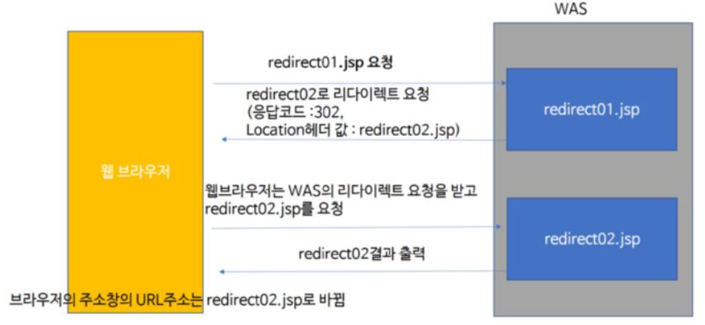
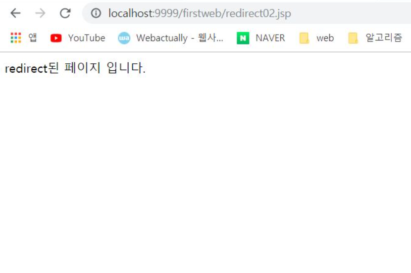
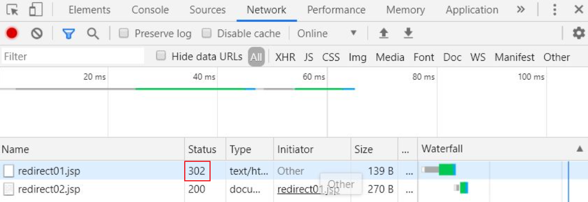

# 리다이렉트(Redirect)

**목차**   
[Redirect 란?](#Redirect-란?)  
[과정](#과정)  
[적용](#적용)   
  - [예시](#예시)  

[결과](#결과)  
[Redirect와 Forward 차이점](#redirect와-forward-차이점)

## Redirect 란?

서버가 클라이언트로부터 요청을 받은 후, 클라이언트에게 **특정 URL**로 이동하라고 요청하는 것

## 과정

1. 서버에서는 클라이언트에게 응답으로 상태코드 302와 이동할 URL정보를 Location 헤더(Header)에 담아 전송
2. 클라이언트는 서버로부터 받은 상태가 302면 Location헤더값으로 재요청
3. 재요청할 때 브라우저의 주소창은 전송받은 URL로 바뀌게 된다.



## 적용

서블릿이나 JSP는 redirect를 하기 위해 HttpServletResponse 객체의 sendRedirect()메소드를 사용

### 예시 

redirect01.jsp를 실행시키면 redirect02.jsp로  redirect시키고 redirect02.jsp에선 redirect되었다는 문구 브라우저에 출력

```
redirect01.jsp
<%
	response.sendRedirect("redirect02.jsp");
%>
```

```
redirect02.jsp
<!DOCTYPE html>
<html>
<head>
<meta charset="EUC-KR">
<title>Insert title here</title>
</head>
<body>
	redirect된 페이지 입니다.
</body>
</html>
```

### 결과



결과는 redirect02.jsp의 내용이 나온 것을 볼 수 있다. 하지만 URL이 redirect02.jsp로 되어있는 것으로 redirect가 재대로 수행이 되었단 걸 알 수 있다.



또한, 위 그림처럼 Network탭을 통하여 redirect01.jsp 요청을 수행후에 코드에 따라 redirect02.jsp로 이동한 것을 볼 수 있다.

## Redirect와 Forward 차이점

redirect와 비슷한 역할을 하는 것으로 포워드가 있다. 
리다이렉트와 포워드 모두 페이지가 전환되지만 아래와 같은 차이점이 있다.

Redirect는 클라이언트가 서버에게 요청(**주체가 클라이언트**)을 하여 서버가 요청할 곳을 알려주면서 다시 요청 -> 따라서 URL이 변화

[Forward](./forword.md)는 클라이언트가 한 요청에 서버가 판단(**주체가 서버**)하여 다른 Back(서버)에게 처리를 맡기는 것으로 클라이언트는 서버가 어떻게 처리하는 지 모른다. -> URL 변화 X

따라서 Redirect는 request response 객체가 2개 생성되고, Forward는 1개 생성된다.